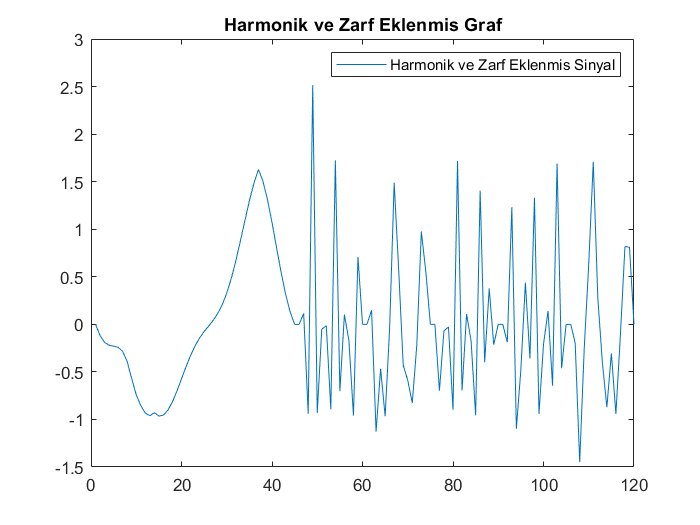

### Ali Köse

### 030117090

### Sinyal İşleme

## Proje: MATLAB ile sentezleme

## Notaların Oluşturulması

- **Projemizde öncelikle Musescore programı üzerinden seçilmiş   olan
Çanakkale İçinde türküsünü seçerek notaları MuseScore uygulamasına  aktarıldı.**

- **Daha sonra bu dosyayı .mscz/.png/.musicxml uzantıları şeklinde exportlandı.**

- **Projeye eklendi.**

## Parse Edilmesi

-  **Öncesinde projeye eklenen note.m Matlab dosyasında parseMusicXMl fonksiyonu  çağrılıp nota.musicxml dosyasının uzantısıyla beraber fonksiyonun içine yazıldı.**

- **Parse Edildi.**

- **Parse işlemi sonucunda  96x16 lık bir matris elde etmiş olundu.
Müziği Sentezleyebilmek için ihtiyaç olan sütunlar Parse fonk. incelenerek tespit edildi.**

## Sentezlenmesi

####  Bu sütunlar 4. 6. ve 7. olmak üzere: 

- **4. Sütun : Vermiş olduğumuz dosyada hangi notaya basıldığını gösterir.**

  > Bu işlemi muzik enstrümanı dijital arayüzü olarak bahsedilen 
>MIDI -Musical Instrument Digital Interface- La notasını baz alan
formül kullanılarak klavye tuşlarına karşılık gelen 
>sayısal değerler hesaplanır.

- **6. Sütun:Her bir notanın basıldığı andaki başlangıç süresini belirtir.**

- **7 Sütun : Bu sütünda 6. sütundaki başlangıç noktası üzerinden ne kadar basıldığını gösterir.***

  >**Yani 6. Sütun ile 7. Sütunlardaki veriler toplandığında bitiş süresi elde edilir.**

- ___4. Sütun için bahsetmiş olduğumuz formül şu şekildedir:___

 - f(m)  =  2^((m−69)/12)*(440 Hz) 

- m => 4. Sütundaki değer yazılarak hesaplanan sonuç o değere ait 
  notanın frekansını    vermiş olur.
### Proje Gelisim Notlari

- note.m dosyası içinde yapılan işlem sentez.m kullanılabilmesi için fonksiyon haline getirildi.
-Note.m de parse edilen eserin içindeki 4. sütundaki değerler La notasına göre formül kullanılarak frekans haline getirildi.

- Sentez.m de yapılması gereken işlemler için note.m ona göre ayarlandı.

- Sentez.m  de frekans adı ile atanmış note.m fonksiyon çağrılarak notaların frekansları elde edildi.

- Her bir nota için yapılması gerektiğinden bu işlemler for döngüsünde tek tek nota adında oluşturulan değişkende tutularak Örneklem frekansı olan 44100 değeri kullanılarak t oluşturuldu.

- En son döngü dışında esere atanıp temel haliyle eser sentezlenerek çalar hale getirilmiştir.

- Harmoni işlemleri olması gerektiği gibi 1 de oluşmayacak şekilde sentez.m dosyasındaki harmonik değişkenine atanan değer kadar harmoni oluşturularak  esere eklendi.

- Zarflar 2. hafta ödevinde anlatıldığı üzere zarflandı. Adsr ya da Exponential  tipi için zarf değişkenine atanan değer ile belirlenecek şekilde oluşturuldu.
- Adsr zarfı için matris çarpımında sorun çıkmaması adına sayıyı en yakın şekilde tam sayıya yuvarlayan round fonksiyonu ile matrisler eşitlenerek adsr tipi zarf sorunu çözüldü.
- Şu anda Exponential zarf tipi için bir hata söz konusu en yakın zamanda düzeltilecek.
- https://ww2.mathworks.cn/help/audio/ref/reverberator-system-object.html#d117e68053 dökümanı kullanılarak reverb fonksiyon pasif şekilde sentez.m eklendi.
- Proje başka bir bilgisayarda clone lanıp denendi.
- Reverb fonksiyonu aktif hale getirildi.
-  Program sonunda istenen harmonik ve zarf ayarları ile oluşturulan sinyal ve reverb eklenen sinyal ayrı ayrı grafiklerde çizdirildi, lejand eklendi.
## Programin Islenmesi

#### note.m Fonksiyonu
		function frekans = note(key)
  		  frekans = 2^((key-69)/12)*440;
		end

- note.m fonksiyonu ile parse edilmis matrisin  4. sütunundaki değerler ile key olarak tanımlanan deger yerine atandiginde La notasi 440 baz alinarak diger notalarin frekansi note fonksiyonuyla nota bazinda hesaplanir hale gelmistir

### Sentez.m Aciklanmasi

		clear all;
		matris = parseMusicXML('muzik/nota.musicxml');

		fs=44100; 
		range=size(matris);
		    Harmonik Sayısı Belirleme 
		harmonik = 3;
		%Zarflamada kullanilacak degiskenler
		adsrzarf = [];
		expzarf= [];
		%Sentezlenmis notalari tutacak degisken
		eser =[];
		 % ADSR ENVELOPE = 1  EXPONANTIAL ENVELOPE = 2
		 zarf = 1;

- Clear all komutu ile daha once suren bir islem var ise temizlenir.
- Parse edilmis nota.musicxml dosyasi matris ismi verilen degiskende tutulur.
- parseMusicXML() fonksiyonu ile matrise cevrilen nota dosyasinin icerigine gore satir sayisi degisiklik gosterir.Sutun sayisi ise sabit olup parseMusicXML() fonksiyonu icinde ingilizce olarak hangi sutunun ne anlama geldigi anlatilmaktadir.Kullanilan sutunlarin ne ise yaradagi README icerisinde yer verilmistir.

- Yukaradaki kod blogunda tanımlanmis degiskenler  zarflama tipinin secilmesi, harmonik sayisi  belirlenmesi,zarflama islemlerinde kullanilicak diziler olusturulmustur.

		 %____________________________Nota Islemleri_____________________________%
    		        %Nota bazında olan tüm Islemler burada yapılmaktadır.
		for i=1: range(1)   //Genel For
		   frekans = note(matris(i,4));
   
 		  t=0:1/fs:matris(i,7);
   
		   nota = cos(2*pi*frekans*t);

- Yapilan  islemler nota bazli oldugundan genel for icinde yapilmistir. Range ile matris kadar tekrar etmesi saglanmistir.
- frekans degiskeninde note fonksiyonu cagrilarak tek tek matrisin 4. sutunu kullanilarak notalarin frekanslari alinir.

- Frekans kullanilarak  notalar dongude  hesaplanir.

 	   	%______________________Harmonik Islemleri______________________________%
  	    % k degeri 2 den baslama sebebi k=1 için harmonik deger yoktur.
  	for k=2:harmonik 
       har= (1/k)*cos(2*pi*k*frekans*t);
       nota = nota + har;
 		end  
 	  %----------------------------------------------------------------------%

- Genel For dongusunun icinde  her notanin ustune  harmonik islemi yapilarak ustune eklenir.Yapilma sebebi gercek sese yaklastirmaktir.

		 %__________________________ADSR ENVELOPE_______________________________%
 		    if(zarf ==1) 
		 duraksama= length(t);
		adsrzarf = [linspace( 0, 1.5, round(duraksama/ 5)) linspace(1.5,1,round(duraksama/10)) ones(1,round(duraksama/2)) linspace(1,0,round(duraksama/5))];
     		  nota = nota .* adsrzarf;
  		   end
		 %----------------------------------------------------------------------%

		     %______________________ EXPONENTIAL ENVELOPE_________________________%
    		  if(zarf==2) 
       		  % t = notalar;
    		  expzarf =  exp( -t /matris(i,2));
  		     nota = nota .* expzarf;
		      end
		   %----------------------------------------------------------------------%
- Scriptin en yukarisinda yorum olarak bahsedilen zarflama islemi secimi ile hangi zarfin kullanilacagi secilmis olur.

- Zarflama islemi ile o an isleme giren nota zarflanarak günlük hayattaki sese yaklastirilir.

- Duyulan sesler ensturmanlarda adsr zarfi icin bahsedilicek olursa nota tek bir sekilde gercek hayatta tek bir yukseklikte isitilmez.O sesin bir attack decay , sustain ve relase zamani vardir. Sesin bu zarflama islemi ile gercekte isittigimiz sese benzetilir.

- Adsr zarflama isleminde kullanilan round fonks ise ones isleminde tam sayi kullanilmasi gerektiginden icindeki sayiyi en yakin tam sayiya cevirir.

-  fix  round  ceil floor Matlab fonksiyonlarindan bu ondalikli sayiyi yuvarlama isleminde en az deger kaybedecek sekilde round fonksiyonu kullanildi.

- Exponential zarflama islemi  ise ussel olarak olcuye ve zaman gore bu islemi gerceklestirir.

- Grafikte gorulecegi uzere  harmonik ve zarflama islemi gerceklestirilmis eserin sinyallarinin  grafige dokulmus  halidir.

		 eser = [eser nota];
		end
		
- Harmonik ve Zarflama islemi gerceklestirilen notalarin  dongunun sonunda her bir nota sirasiyla eser dizininde tutulur.Boylece girilen eser sentezlenmis halde elde edilir.

		 %_____________________________Reverb Etkisi_______________________________%
		 reverb = reverberator('PreDelay',0.5,'WetDryMix',1);
		 %Reverb Fonksiyonunda Sütun olarak islem gerceklestiginden transpz. alıncak
		 yanki = eser';  
		 % 'Transpozesi alinan eser yankiya atanarak reverb islemi gerceklestirilir.
		 muzik= reverb(yanki);
		 %Reverblenmis eser son olarak caldirilir.
		 sound(muzik,44100);
		 %-------------------------------------------------------------------------%
- for dongusu disinda sentezlenmis olan eser yanki eklenerek duydugumuz sese en yakin hale getilir.

- Bu islem gerceklestirilirken Reverberation fonksiyonu kullanildi.

- Parcaya uygun olacak sekilde PreDelay ve WetDryMix degerleri ayarlanabilir.

- Reverberation  fonksiyonunun kullanilabilmesi icin satirda tutulan islenmis notalar transpozesi alinarak reverb fonksiyonu kullanilarak belirlenen degerler ile yanki eklenir.

- Reverb isleminden gecirilmis eserin sadece zarf ve harmonik isleminden gecirilmesinden sonraki haliyle farkı burada gozlenmis olur.

- Son olarak Harmonikleri eklenmis , zarflanmis ve reverb isleminden gecirilmis ses sinyali sound fonksiyonu kullanilarak sound(muzik,44100)  Sample rate orneklem uzayi ile calinmis olur.

- Orneklem uzayi ise Sample Rate bilgisayarin anlayacagi sekilde dijital e cevrilmesi icin kullanilir.Bir saniyede veya bir kesitte saniyede kaç kere orneklendigini gosterir.

## 16. Olcudeki Notalarin Islenme Durumuna Gore Graflari

- Burada tek bir olcu olan 16. olcu uzerinden islemler gerceklestirilir.

- Bu islemler icinse Parse fonksiyonunda elde edilen matrisin 8. sutununda hangi olcudeki nota oldugu belirtilmistir.